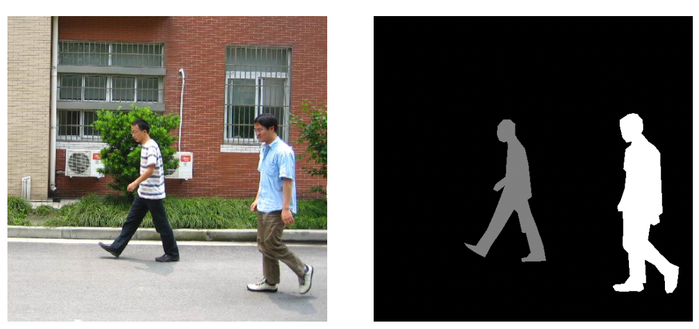
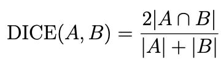
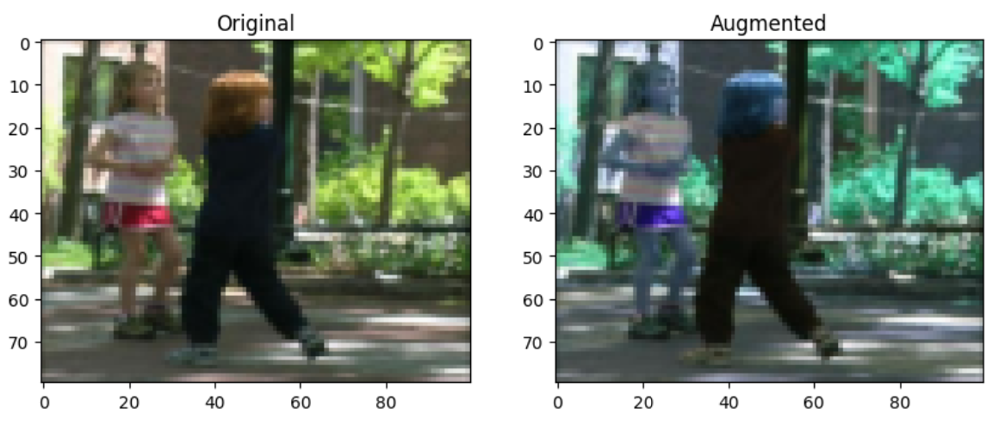
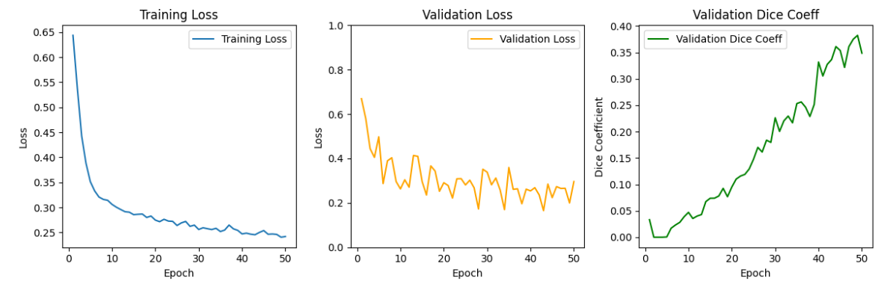
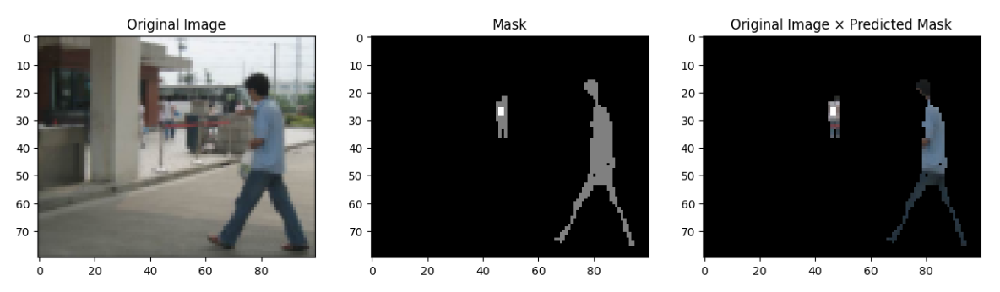
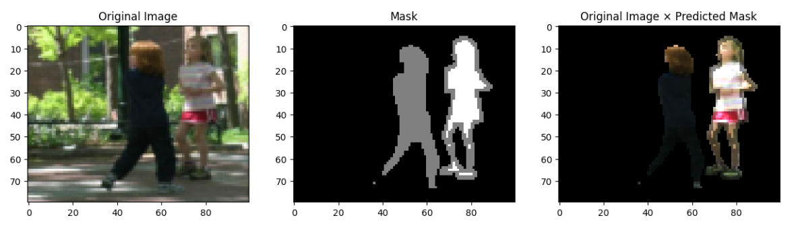
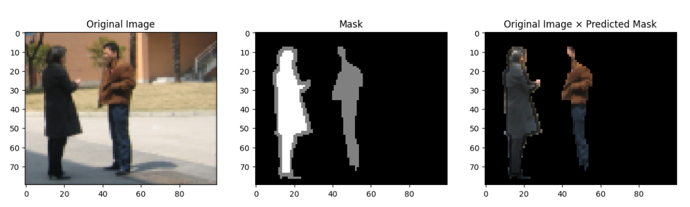
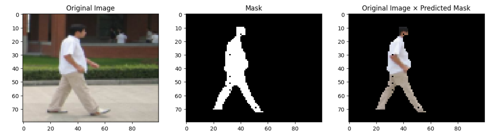
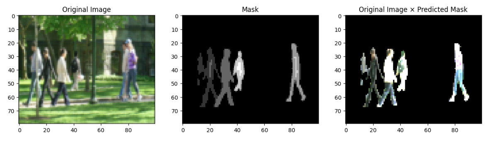

# Binary Segmentation of Pedestrian Images

In this project, the goal is to implement and train a convolutional neural network (CNN) for binary segmentation of pedestrian images using Pytorch. The trained network is able to produce a probability mask for the scene, with which we threshold at p = 0.5 during inference to decide if a pedestrian is at the pixel location or not.

We used the FudanPed dataset for this project, which contains 170 samples of RGB image - segmentation mask pairs. An example is given as below:

The provided segmentation mask assigns a different value to each instance of a pedestrian in the image (notice in Fig. 1 a gray mask and white mask). For this task, we binarized the mask by setting all values greater-than or equal-to 1 to 1. This converted the original dataset from the instance-segmentation task to the binary segmentation task.

We use the DICE score to evaluate the binarized output of the network against the ground truth segmentation mask. The DICE score of two sets A and B is defined as:

It measures the overlap between A and B, normalized by the size of each set individually. To train the network, we use the so-called “soft-dice“ loss:

where p, q are the un-binarized output mask of the neural network and the ground-truth binary segmentation mask, and ε ≈ 1 is used for numerical stability.

For training the model, we first apply data augmentation. the original and augmented data look as below:

Next, we create an instance of the U-Net neural network, and initialize the hyperparameters. We set up an SGD optimizer with specified parameters (learning rate, momentum, weight decay) to train the model. Here is a visual representation of the training and validation metrics (loss and Dice coefficient):

Here are some examples of the original and masked images:

